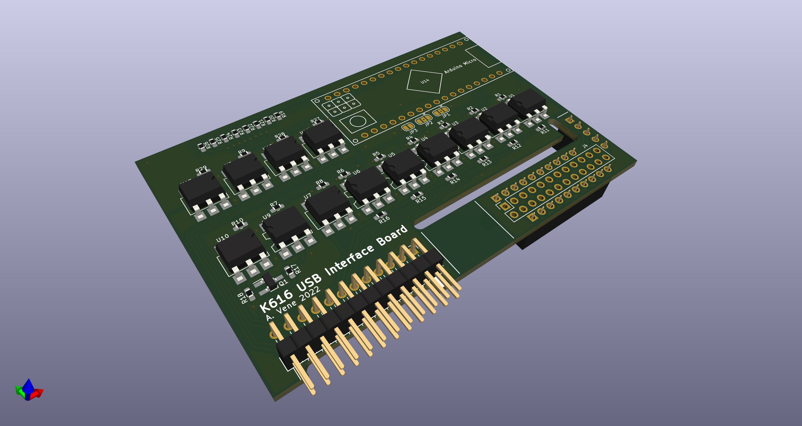
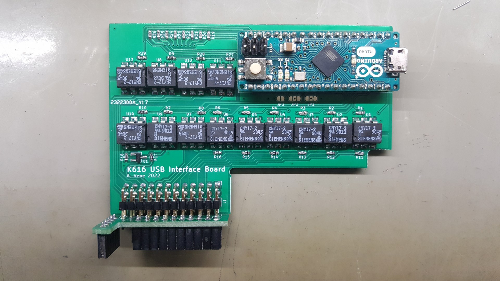
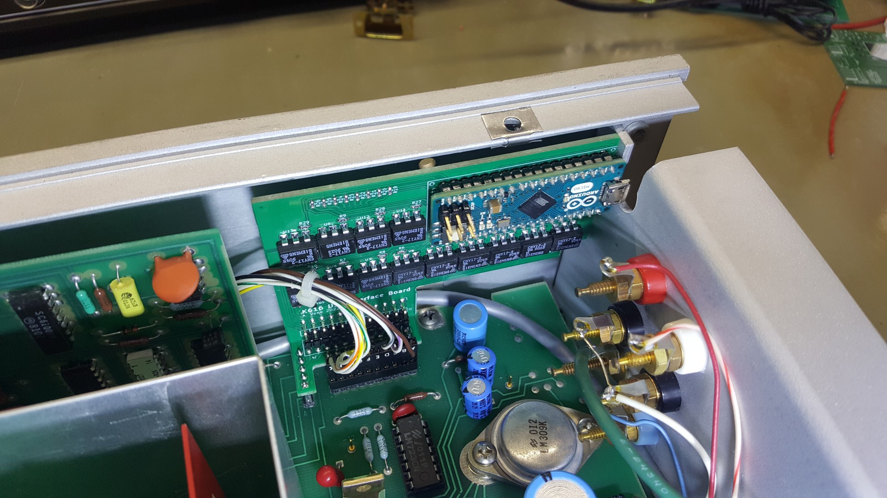

# K616 USB Interface board

Arduino based USB interface board for Keithley 616 digital electrometer. Somewhat inspired by Keithley 6162 Isolated Output and Control module, but with a modern computer interface.

## Firmware features

- Presents a common USB serial interface
- Measurement capture using hardware counter and interrupts
- Instrument control (Remote zero check, Sensitivity selection and Display hold)
- Continuous or single measurement output
- Compact and human readable output formats
- Mostly single character commands for instrument and interface control
- Interface settings can be saved to load on next power up

## Hardware features

- Optically isolated inputs and outputs
- Mounts inside the instrument with USB port accessible on the back panel
- Fits on to K6162 interface pins headers (J113, J114 and J115) on the main board

# Measurement output

Output strings consist of three parts separated by space characters: 
- a float type number representing the measured value
- units of the measured value
- instrument state indicators

In normal or "compact" output mode (selected by sending `u` command character) the number mirrors the instrument display, where sensitivity setting directly determines the number of decimal places of mantissa and the exponent is determined form range switch position. Units are also determined by range switch position. Instrument state indicators are printed as single characters:
- `N` ... Normal operation
- `O` ... Overflow
- `Z` ... Zero Check
- `R` ... Remote Zero Check
- `A` ... Auto sensitivity
- `M` ... Manual sensitivity
- `H` ... Display hold enabled 

In human friendly output mode (selected by sending `U` command character) the number of decimal places and unit prefix are determined based on what is most appropriate for currently selected range and sensitivity settings. The instrument state indicator characters get replaced by whole words separated by space characters.

## Example outputs strings

Normal operation (measuring resistance, automatic sensitivity):

    +0.993E9 Ohm NA

Human friendly unit display (same conditions as above):

    +0.992 GOhm Normal Auto

Remote zero check enabled:

    -0.00000E-6 A ZRA

    -0.00 nA Zero Remote Auto

Overflow condition, manual sensitivity:

    +0.2016E0 V OM

    +201.6 mV Overflow Manual

Instrument powered off (no "gated clock" and "count now" signals detected)

    -999.9E-6 A ERR

    -999.9 uA Count Error

# Command set

The interface board can be controlled using mostly single character commands, exception being the sensitivity select command which consists of two characters.

## Instrument control:

`Z|z`: Remote zero check (upper case to enable, lower case to disable)

`H|h`: Instrument display hold (upper case to enable, lower case to disable)

`r[x]`: Sensitivity select, where [x] is a number representing different sensitivity settings:
- 0 ... Auto sensitivity
- 1 ... 0,01 full scale
- 2 ... 0,1 full scale
- 3 ... 1 full scale
- 4 ... 10 full scale
- 5 ... 100 full scale

## Interface control:

`S|s`: Continuous measurement output (upper case to enable, lower case to disable)

`p`: Print measurement result once

`U|u`: Human friendly output (upper case to enable, lower case to disable)

`f`: Save current interface configuration to EEPROM to load on next power cycle

`i`: Print ID string (useful when determining if the correct port is being used)

`?`: Print help message
